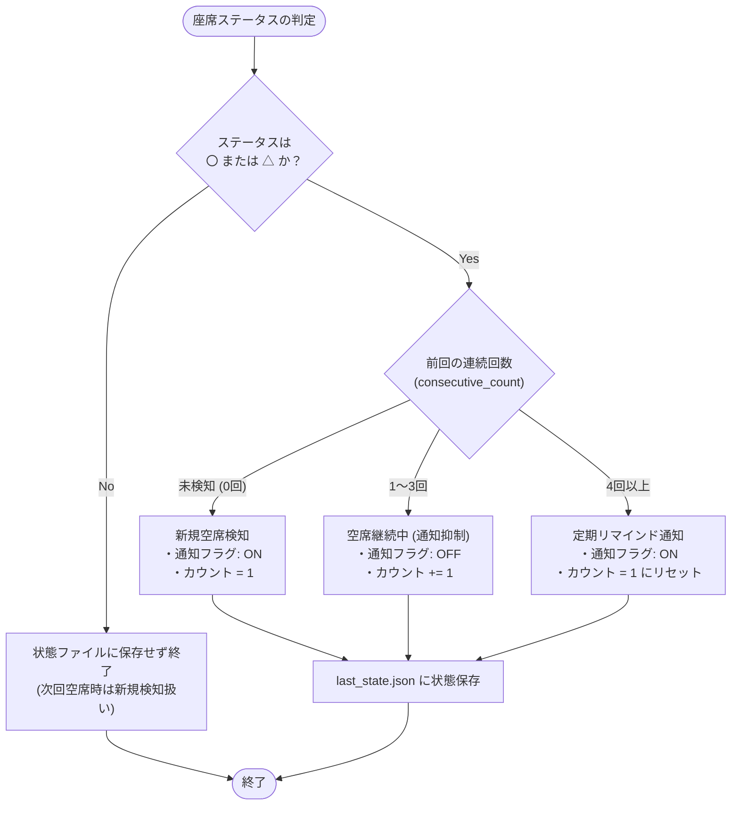

# Sakana Insight - 列車空席照会システム 技術仕様書 (Technical Specification)

## 1. システム概要

### 1.1 背景と目的
「WEST EXPRESS 銀河」や「サンライズ出雲・瀬戸」などの人気夜行列車・観光列車は、発売開始直後に満席となることが多く、予約確保にはキャンセル発生時の空席検知が極めて重要です。  
本システム「**Sakana Insight**」は、JR西日本のネット予約サービス「**e5489**」の空席照会結果を Playwright（ヘッドレスブラウザ）を用いて自動巡回・スクレイピングし、空席を検知した際に **LINE Messaging API** を通じてリアルタイム通知を行うとともに、取得結果を蓄積して **Webダッシュボード** で可視化・分析することを目的としています。

### 1.2 主な対象列車
- **WEST EXPRESS 銀河**
  - **紀南コース**: 京都 ⇔ 新宮（下り・上り）
  - **山陰コース**: 京都 ⇔ 出雲市（下り・上り）
- **サンライズ出雲・瀬戸**
  - **サンライズ瀬戸**: 東京 ⇔ 高松（下り・上り）
  - **サンライズ出雲**: 東京 ⇔ 出雲市（下り・上り）

---

## 2. システムアーキテクチャ

### 2.1 ディレクトリ・ファイル構成

```
sakana/
├── ginga.py                # WEST EXPRESS 銀河 照会スクリプト
├── sunrise.py              # サンライズ出雲・瀬戸 照会スクリプト
├── config.json             # 銀河の運行日スケジュール設定
├── last_state.json         # 直近の空席状態・連続検知管理用ステート
├── specification.md        # 技術仕様書（本文書）
├── utils/
│   ├── __init__.py
│   ├── date_utils.py       # JST日時計算、照会対象日（1ヶ月以内）フィルタ
│   ├── scraper.py          # Playwright による e5489 ページ巡回・ステータス抽出
│   ├── runner.py           # 照会フロー統合制御、URL生成、通知判定、ログ集約
│   ├── history.py          # 状態管理 (last_state) およびログ永続化 (30日分維持)
│   └── line_api.py         # LINE Messaging API 送信 (Broadcast / Push)
└── docs/                   # Webダッシュボード (GitHub Pages 等で静的ホスト)
    ├── index.html          # ダッシュボード UI
    ├── css/                # スタイルシート
    ├── js/                 # ダッシュボード用スクリプト (Chart.js 連携)
    ├── config.json         # フロントエンド用設定
    ├── log_kinan.json      # 紀南コース アクセスログ (過去30日)
    ├── log_sanin.json      # 山陰コース アクセスログ (過去30日)
    └── log_sunrise.json    # サンライズ アクセスログ (過去30日)
```

### 2.2 モジュール責務一覧

| モジュール | 責務 |
| :--- | :--- |
| **`ginga.py`** | `config.json` を読み込み、1ヶ月以内の対象日に対して紀南/山陰コースの照会条件を作成し `runner` を呼び出す。コマンドライン引数（`kinan` / `sanin`）で単一実行可能。 |
| **`sunrise.py`** | 当日便および `config.json` で指定された有効日（1ヶ月以内）を対象とし、サンライズ瀬戸・出雲のノビノビ座席および各個室の照会条件を作成して `runner` を呼び出す。 |
| **`utils/runner.py`** | 照会条件リストを受け取り、Playwright ブラウザのライフサイクル管理、パラメータグルーピングによるアクセス最適化、通知判定、ログ記録を実行する。 |
| **`utils/scraper.py`** | 指定された URL へアクセスし、混雑時（エラーコード 20100801 等）のリトライ処理を行い、`data-search-id` に紐づく座席ステータスを抽出する。 |
| **`utils/history.py`** | `last_state.json` の読み書き、および `docs/log_{course}.json` へのアクセスログ追記・30日超過データの自動ローテーションを行う。 |
| **`utils/date_utils.py`** | JST（日本標準時）の取得、翌月同日計算、および今日〜1ヶ月後の照会可能範囲内に対象日を絞り込むロジックを提供する。 |
| **`utils/line_api.py`** | 環境変数からアクセストークンを読み込み、LINE Messaging API（Broadcast または Push）へ HTTP POST を行う。 |

---

## 3. 処理フロー

### 3.1 全体処理フロー図

```mermaid
flowchart TD
    subgraph Trigger["起動・トリガー"]
        Cron["定期実行スケジューラ<br>(cron / タスクスケジューラ / GitHub Actions)"]
    end

    subgraph EntryPoint["エントリポイント"]
        Start(["実行開始"])
        TargetSelect{"対象選択"}
        Ginga["ginga.py<br>(WEST EXPRESS 銀河)"]
        Sunrise["sunrise.py<br>(サンライズ出雲・瀬戸)"]
        LoadConfig["config.json 読み込み"]
        FilterDate["date_utils.py<br>今日〜1ヶ月以内の運行日を抽出"]
    end

    subgraph Runner["runner.py (実行制御 & スクレイピング)"]
        LaunchBrowser["Playwright 起動<br>(Chromium Headless)"]
        LoopCond{"対象日・区間毎にループ"}
        BuildUrl["e5489 照会URL生成<br>(同一列車カナパラメータをグループ化)"]
        
        subgraph Scraper["scraper.py"]
            FetchPage["e5489 結果ページアクセス"]
            CheckBusy{"混雑判定<br>(混雑中 / 20100801)"}
            Retry["待機 (2秒) & リトライ (最大5回)"]
            ParseStatus["座席アイコン判定<br>(〇 / △ / × / 情報なし)"]
        end
        
        EvalState{"通知判定<br>(last_state.json 参照)"}
        LogCollect["アクセスログ収集"]
        CloseBrowser["Playwright 終了"]
    end

    subgraph Persistence["データ永続化 (history.py)"]
        SaveState["last_state.json 更新<br>(連続検知回数を保持)"]
        SaveLogs["docs/log_{course}.json 追記<br>(直近30日分を維持)"]
    end

    subgraph Notification["通知処理 (line_api.py)"]
        CheckSeats{"通知対象の空席があるか？"}
        SendLine["LINE Messaging API 送信<br>(Broadcast / Push)"]
        SkipLine["通知スキップ"]
    end

    subgraph Dashboard["Webダッシュボード"]
        BrowserUser["ユーザー"]
        ViewDash["docs/index.html 閲覧<br>(Chart.js による統計・履歴表示)"]
    end

    %% フロー接続
    Cron --> Start
    Start --> TargetSelect
    TargetSelect -->|"銀河 (kinan / sanin)"| Ginga
    TargetSelect -->|"サンライズ"| Sunrise
    Ginga --> LoadConfig
    Sunrise --> LoadConfig
    LoadConfig --> FilterDate
    FilterDate --> LaunchBrowser

    LaunchBrowser --> LoopCond
    LoopCond -->|次の照会条件| BuildUrl
    BuildUrl --> FetchPage
    FetchPage --> CheckBusy
    CheckBusy -->|混雑検知| Retry
    Retry --> FetchPage
    CheckBusy -->|正常表示| ParseStatus
    ParseStatus --> EvalState
    EvalState --> LogCollect
    LogCollect --> LoopCond
    LoopCond -->|全条件終了| CloseBrowser

    CloseBrowser --> SaveState
    CloseBrowser --> SaveLogs
    CloseBrowser --> CheckSeats

    CheckSeats -->|空席あり (通知対象)| SendLine
    CheckSeats -->|空席なし または 抑制中| SkipLine

    SaveLogs -.->|ログファイル参照| ViewDash
    BrowserUser --> ViewDash
```

---

## 4. e5489 スクレイピング & 座席定義仕様

### 4.1 照会 URL フォーマット
e5489 の特定列車照会エンドポイントに対して、以下のパラメータ付き GET リクエストを発行します。

```text
https://e5489.jr-odekake.net/e5489/cspc/CBDayTimeArriveSelRsvMyDiaPC?
  inputDepartStName={depart}&inputArriveStName={arrive}&inputType=0&
  inputDate={date}&inputHour={hour}&inputMinute={minute}&
  inputUniqueDepartSt=1&inputUniqueArriveSt=1&inputSearchType=2&
  inputTransferDepartStName1={depart}&inputTransferArriveStName1={arrive}&
  inputTransferDepartStUnique1=1&inputTransferArriveStUnique1=1&
  inputTransferTrainType1=0001&inputSpecificTrainType1=2&
  inputSpecificBriefTrainKana1={param}&SequenceType=0
```

- **`depart` / `arrive`**: 駅名の Shift-JIS URLエンコード文字列
  - 京都: `%8B%9E%93s`
  - 新宮: `%90V%8B%7B`
  - 出雲市: `%8Fo%89_%8Es`
  - 東京: `%93%8C%8B%9E`
  - 高松: `%8D%82%8F%BC%81i%8D%81%90%EC%8C%A7%81j`
- **`date`**: `YYYYMMDD` 形式
- **`hour` / `minute`**: 検索基準時刻（下り銀河: 21:00、上り銀河: 09:00、サンライズ: 18:00）
- **`inputSpecificBriefTrainKana1` (`param`)**: 列車指定パラメータ（半角カナ等のエンコード）

### 4.2 WEST EXPRESS 銀河 座席マッピング

| コース | 席種名 | 列車カナパラメータ (`param`) | `data-search-id` |
| :--- | :--- | :--- | :--- |
| **紀南（下り）** | クシェット | `%B7%C5%B8%BC%D4000` | `3010000` |
| | ファーストシート | `%B7%C5%CC%B1%D4000` | `1010000` |
| | プレミアルーム1 | `%B7%C5%CC1%D4000` | `11100C1` |
| | プレミアルーム2 | `%B7%C5%CC2%D4000` | `11100D1` |
| **紀南（上り）** | クシェット | `%B7%C5%B8%BC%CB000` | `3010000` |
| | ファーストシート | `%B7%C5%CC%B1%CB000` | `1010000` |
| | プレミアルーム1 | `%B7%C5%CC1%CB000` | `11100C1` |
| | プレミアルーム2 | `%B7%C5%CC2%CB000` | `11100E1` |
| **山陰（上下共通）** | クシェット | `%B7%B2%DD%B8%BC000` | `3010000` |
| | ファーストシート | `%B7%B2%DD%CC%B1000` | `1010000` |
| | プレミアルーム1 | `%B7%B2%DD%CC1000` | `11100C1` |
| | プレミアルーム2 | `%B7%B2%DD%CC2000` | `11100D1` |

### 4.3 サンライズ出雲・瀬戸 座席マッピング

各列車において、1つの URL (`param`) から複数の座席（`data-search-id`）を同時に判定します。

| 列車 | 席種名 | 列車カナパラメータ (`param`) | `data-search-id` |
| :--- | :--- | :--- | :--- |
| **サンライズ瀬戸** | ノビノビ座席 | `%BB%BE%C4%20%20000` | `3010000` |
| | シングルツイン(禁煙) | `%BB%BE%C4%20%20000` | `4110042` |
| | シングルツイン(喫煙) | `%BB%BE%C4%20%20000` | `4120042` |
| | シングルデラックス(禁煙) | `%BB%BE%C4%20%20000` | `2110002` |
| | シングルデラックス(喫煙) | `%BB%BE%C4%20%20000` | `2120002` |
| | ソロ | `%BB%BE%C4%BF%20000` | `4110040` |
| | シングル(禁煙) | `%BB%BE%C4%BC%20000` | `4110041` |
| | シングル(喫煙) | `%BB%BE%C4%BC%20000` | `4120041` |
| | サンライズツイン(禁煙) | `%BB%BE%C4%BB%20000` | `4110062` |
| | サンライズツイン(喫煙) | `%BB%BE%C4%BB%20000` | `4120062` |
| **サンライズ出雲** | （上記と同席種構成） | `%BB%B2%BD%D3%20000` 等 | （同上） |

### 4.4 スクレイピング判定ロジック
1. HTML 内の `td[data-search-id='{ID}'] img` 要素を探索。
2. `alt` 属性値からステータスを変換：
   - `空席あり` → **`〇`**
   - `空席残りわずか` → **`△`**
   - `残席なし` / `座席なし` → **`×`**
   - 要素が存在しない場合 → **`情報なし`**
   - 例外発生時 → **`取得エラー`**
3. ページ内に「混雑中」またはコード「20100801」が含まれる場合は 2 秒待機して最大 5 回まで再試行。

---

## 5. 通知仕様 (LINE Messaging API)

### 5.1 通知方式

- **Broadcast (`/v2/bot/message/broadcast`)**:  
  `ginga.py` で利用。友だち登録している全ユーザーに一斉配信。
- **Push (`/v2/bot/message/push`)**:  
  `sunrise.py` で利用。指定された `LINE_USER_ID` の特定ユーザー宛てに配信。

### 5.2 連続検知通知抑制（スパム防止）アルゴリズム

空席が長時間残っている場合に通知が毎分送信されるのを防ぐため、`last_state.json` を用いた連続検知カウンタを実装しています。



- **新規検知**: 即座に通知（カウント = 1）
- **継続検知**: 2回目・3回目は通知スキップ（カウントを加算）
- **リマインド**: 4回連続検知時に再通知を行い、カウントを 1 にリセット

### 5.3 メッセージフォーマット例

```text
【空席照会結果】
列車名：WEST EXPRESS 銀河（紀南コース）
取得日時：2026-09-06 21:05:12
検索対象：下り: 09/07, 09/11 | 上り: 09/09, 09/13

■09/07(月) 京都→新宮
　クシェット：〇
　プレミアルーム1：△

https://fkks33.github.io/sakana/
```

---

## 6. データ永続化・ログ仕様

### 6.1 `last_state.json` (状態管理)
各座席の連続空席状態を保持する辞書形式。

```json
{
  "kinan_20260907_紀南コース(下り)_クシェット": {
    "status": "〇",
    "consecutive_count": 1
  }
}
```

### 6.2 `config.json` (スケジュール設定)
照会対象となる運行日（`YYYYMMDD`）のリスト。

```json
{
  "sunrise": {
    "target_dates": ["20260915", "20260920"]
  },
  "kinan": {
    "kyoto_to_shingu": ["20260904", "20260907", "20260911"],
    "shingu_to_kyoto": ["20260906", "20260909", "20260913"]
  },
  "sanin": {
    "kyoto_to_izumo": ["20260601", "20260612"],
    "izumo_to_kyoto": ["20260603", "20260613"]
  }
}
```

### 6.3 `docs/log_{course}.json` (アクセスログ)
Web ダッシュボードのグラフ描画に使用される詳細ログ。  
JST 現在時刻から**過去 30 日分**のログのみが保持され、それ以前のデータは自動的に切り捨てられます。

```json
[
  {
    "timestamp": "2026-09-06T21:05:12.345678+09:00",
    "train": "紀南コース(下り)",
    "depart": "京都",
    "arrive": "新宮",
    "target_date": "20260907",
    "direction": "kudari",
    "seat_type": "クシェット",
    "result": "〇",
    "url": "https://e5489.jr-odekake.net/e5489/cspc/CBDayTimeArriveSelRsvMyDiaPC?..."
  }
]
```

---

## 7. Webダッシュボード仕様 (`docs/`)

GitHub Pages 等で静的ホスティングされ、蓄積されたログをグラフィカルに可視化します。

- **ホスティングURL例**: `https://fkks33.github.io/sakana/`
- **主要機能**:
  1. **最新ステータス一覧**: 路線・日付・席種ごとの最新の空席状況（〇/△/×）をバッジ表示
  2. **席種別空席出現率**: Chart.js ドーナツグラフによる席種別のキャンセル発生比率
  3. **時間帯別空席検知件数**: 棒グラフによるキャンセル発生時間帯の傾向分析
  4. **直近検知タイムライン**: 直近に発生した空席履歴をタイムライン表示（ページネーション・展開機能）
  5. **アクセスログ詳細ビューア**: 過去の照会ログの検索・閲覧

---

## 8. 動作環境とセットアップ

### 8.1 動作環境
- **Python**: 3.9 以上
- **Playwright**: Chromium ブラウザバイナリが必要（`playwright install chromium`）

### 8.2 必要な環境変数
| 環境変数名 | 必須 | 用途 |
| :--- | :---: | :--- |
| `LINE_CHANNEL_ACCESS_TOKEN` | ○ | LINE Messaging API 送信用チャネルアクセストークン |
| `LINE_USER_ID` | △ | `sunrise.py` で Push 通知を行う場合の宛先ユーザー ID |

### 8.3 実行コマンド例

```bash
# 依存関係インストール
pip install playwright requests
playwright install chromium

# 銀河（全コース）実行
python ginga.py

# 銀河（紀南コースのみ）実行
python ginga.py kinan

# サンライズ実行
python sunrise.py
```
